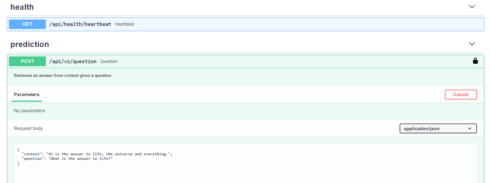
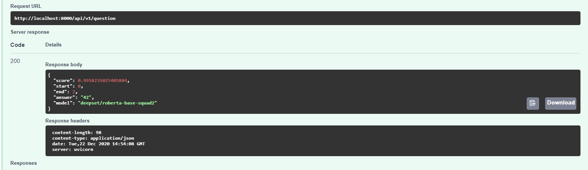

# Question Answering API
> 🤗 Huggingface + ⚡ FastAPI = ❤️ Awesomeness. How to structure Deep Learning model serving REST API with FastAPI


How to server Hugging face models with FastAPI, the Python's fastest REST API framework. 

The minimalistic project structure for development and production. 

Installation and setup instructions to 
run the development mode model and serve a local RESTful API endpoint.

## Project structure

Files related to application are in the `huggingfastapi` or `tests` directories.
Application parts are:

    huggingfastapi
    ├── api              - Main API.
    │   └── routes       - Web routes.
    ├── core             - Application configuration, startup events, logging.
    ├── models           - Pydantic models for api.
    ├── services         - NLP logics.
    └── main.py          - FastAPI application creation and configuration.
    │
    tests                - Codes without tests is an illusion 

## Swagger Example



## Requirements

Python 3.6+, [Make and Docker]

## Installation
Install the required packages in your local environment (ideally virtualenv, conda, etc.).
<!-- ```bash
pip install -r requirements
```  -->

```sh
python -m venv .venv
source .venv/bin/activate
make install
```

#### Running Localhost

```sh
make run
```

#### Running Via Docker

```sh
make deploy
```

#### Running Tests

```sh
make test
```

## Setup
1. Duplicate the `.env.example` file and rename it to `.env` 

2. In the `.env` file configure the `API_KEY` entry. The key is used for authenticating our API. <br>
   Execute script to generate .env, and replace `example_key`with the UUID generated:

```bash
make generate_dot_env
python -c "import uuid;print(str(uuid.uuid4()))"

```

## Run without `make` for development

1. Start your  app with: 
```bash
PYTHONPATH=./huggingfastapi uvicorn main:app --reload
```

2. Go to [http://localhost:8000/docs](http://localhost:8000/docs) or  [http://localhost:8000/redoc](http://localhost:8000/redoc) for alternative swagger
   
3. Click `Authorize` and enter the API key as created in the Setup step.

   
## Run Tests without using `make`

Intall testing libraries and run `tox`:
```bash
pip install tox pytest flake8 coverage bandit
tox
```
This runs tests and coverage for Python 3.8 and Flake8, Bandit.


# TODO
- [X] Change make to invoke: invoke is overrated
- [ ] Add endpoint for uploading text file and questions
